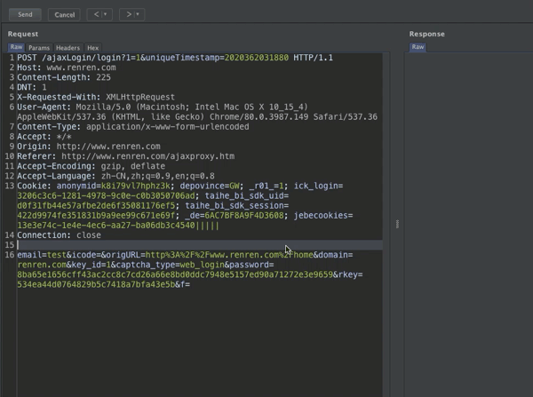

# BurpCrypto
尝试提供一个可定制的BurpSuite加解密插件代码框架

## 介绍

在测试网站或APP过程中，经常遇到数据包加密的场景，相比打开一个在线解密网站每次复制加密密文过去解密分析，若是能直接在BurpSuite抓包中，在Proxy或Repeater里直接右键菜单选择解密功能进行解密，会方便很多。

因此，这里提供一个可自行定制加解密算法的BurpSuite插件框架，可快速灵活的调整加解密算法，导入BurpSuite中进行使用。

## 使用

* 代码使用`Python`编写，需要`Jython`，也需要配置`site-packages`路径来使用第三方库。
* **代码中已写上详细注释**，可直接修改对应代码增加加解密算法
* 将py文件导入到BurpSuite中

**2020/12/10日更新：**

增加Intruder模块中的Payload Processor，可自定义代码处理Payload

使用演示：

## 注意

Python下最常使用的加密解密算法库是`Crypto`，但是由于该库底层是以C语言开发，`Jython`无法使用，因此使用插件时需要另外找替代的库。如插件代码样例中的`AES加解密算法`，使用的是纯Python开发的`pyaes`库。

